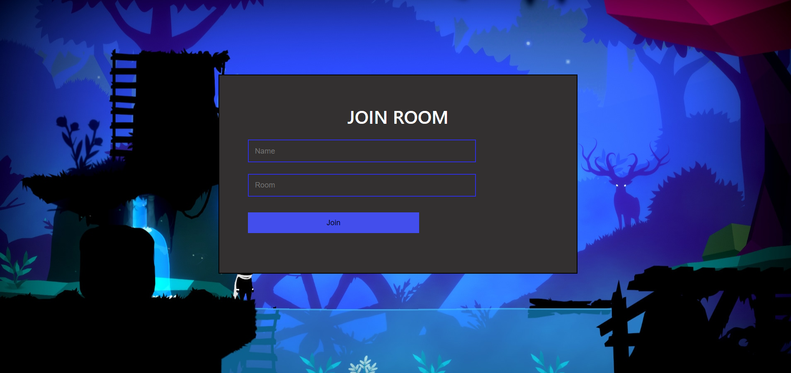
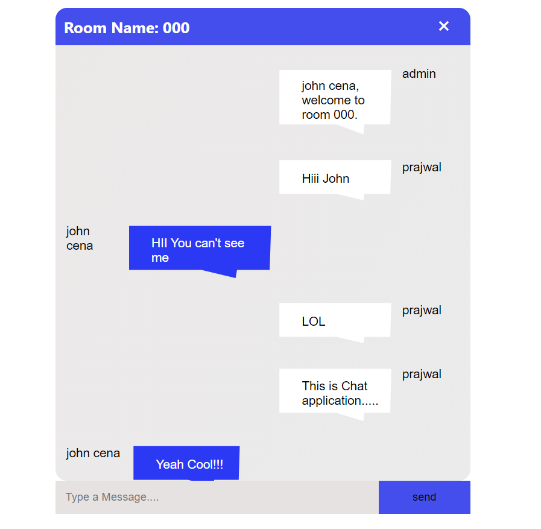
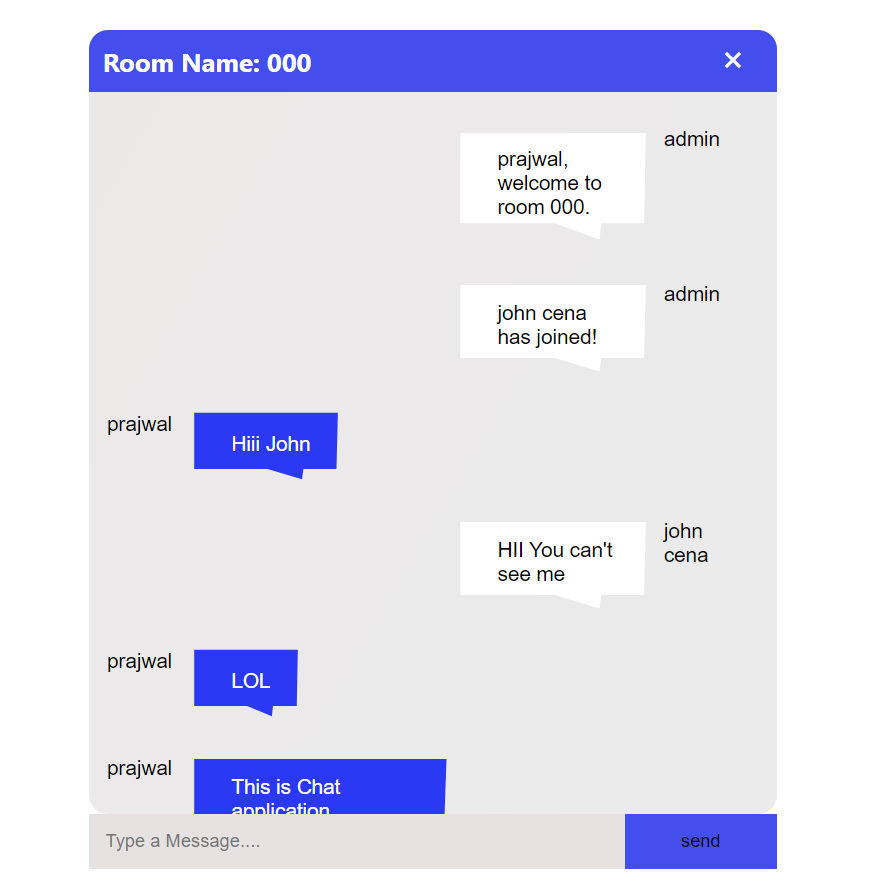

React-js Real time chat application built through socket.io.Socket.IO is a library that enables real-time, bidirectional and event-based communication between the browser and the server.Getting started with socket.io

 
